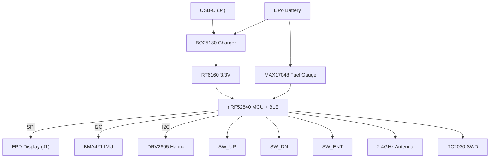

# InkWatch_TSC_Project

## Descriere

Proiectul meu este un smartwatch simplificat, cu focus pe consum redus și integrarea mai multor funcționalități pe un PCB mic. Am folosit un nRF52840 ca MCU principal și am conectat la el senzori, display e-paper și haptic.

Funcționalități:
- display e-paper
- BLE pentru comunicare
- accelerometru pentru mișcare
- feedback haptic
- încărcare USB-C

---

## Schema Bloc

## Bill of Materials

| Ref | Component | Package | Funcție | LCSC | Datasheet |
|-----|----------|--------|--------|------|----------|
| U1 | nRF52840-QIAA | QFN73 | MCU + BLE | [C190794](https://jlcpcb.com/partdetail/C190794) | https://infocenter.nordicsemi.com |
| IC1 | BQ25180YBGR | DSBGA-8 | Charger LiPo | [C3682423](https://jlcpcb.com/partdetail/C3682423) | https://www.ti.com |
| IC9 | RT6160AWSC | WLCSP-15 | Regulator 3.3V | [C7065276](https://jlcpcb.com/partdetail/C7065276) | https://www.richtek.com |
| U3 | MAX17048G+T10 | DFN | Fuel gauge | [C2682616](https://jlcpcb.com/partdetail/C2682616) | https://www.analog.com |
| IC3 | BMA421 | LGA | IMU | [C5242966](https://jlcpcb.com/partdetail/C5242966) | https://www.bosch-sensortec.com |
| IC2 | DRV2605L | VSSOP | Haptic driver | [C527464](https://jlcpcb.com/partdetail/C527464) | https://www.ti.com |
| D3 | USBLC6 | SOT-23-6 | ESD USB | [C2687116](https://jlcpcb.com/partdetail/C2687116) | https://www.st.com |
| J4 | USB-C | SMD | Conector alimentare | [C165948](https://jlcpcb.com/partdetail/C165948) | - |
| J1 | FPC 24 pini | SMD | Conector display | [C393234](https://jlcpcb.com/partdetail/C393234) | - |
| J2 | TC2030 | PTH | Debug SWD | - | - |
| ANT1 | 2450AT18B100E | SMD | Antenă BLE | - | https://www.johansontechnology.com |

---

## Funcționalitate Hardware

### Power

USB-C (5V) -> BQ25180 -> RT6160 -> 3.3V -> sistem

- BQ25180 face charging + power path
- RT6160 generează 3.3V stabil
- MAX17048 citește nivelul bateriei

---

### MCU - nRF52840

Este componenta principală:
- BLE integrat
- controlează toate perifericele

---

### Display E-Paper

Conectat prin SPI:
- SCK - P0.02
- MOSI - P0.03
- CS - P0.05
- DC - P0.15
- RST - P0.16
- BUSY - P0.17

---

### IMU - BMA421

- I2C (SDA P0.06 / SCL P0.07)
- interrupt pe P0.08 și P1.08

---

### Haptic – DRV2605

- I2C
- enable pe P0.12

---

### USB

- USB-C pentru alimentare
- protecție ESD (USBLC6)

---

## Pini nRF52840

| Pin | Semnal | Funcție |
|-----|--------|--------|
| P0.02 | SCK | SPI |
| P0.03 | MOSI | SPI |
| P0.05 | CS | Display |
| P0.06 | SDA | I2C |
| P0.07 | SCL | I2C |
| P0.08 | INT1 | IMU |
| P0.12 | HAPTIC_EN | Haptic |
| P0.13 | SW_UP | Buton |
| P0.14 | SW_DN | Buton |
| P0.15 | DC | Display |
| P0.16 | RST | Display |
| P0.17 | BUSY | Display |
| P1.00 | SW_ENT | Buton |
| P1.01 | EPD_PWR | Power gate |
| P1.08 | INT2 | IMU |
| P0.24 | SWDCLK | Debug |
| P0.25 | SWDIO | Debug |

---

## PCB Design

- 2 layere (Top + Bottom)
- GND polygon pour pe ambele
- trasee:
  - power: 0.3mm
  - semnal: 0.15mm

### Decizii:
- antena la margine cu keepout
- decuplare lângă IC-uri
- rutare manuală pentru trasee critice

---

## Observații

- rutare destul de densă în zona MCU
- unele trasee mai subțiri în zona BGA
- câteva GND trase manual

---

## Concluzie

Proiectul este complet funcțional din punct de vedere hardware și include toate modulele necesare pentru un smartwatch simplu.
